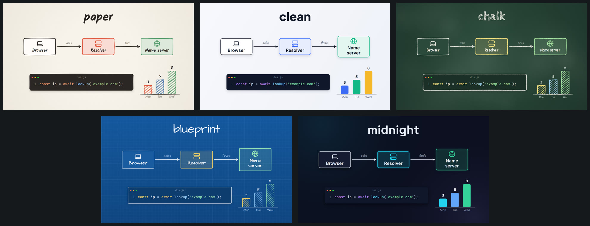

<p align="center">
  <a href="https://www.explainroo.com">
    <picture>
      <source media="(prefers-color-scheme: dark)" srcset="docs/media/logo-dark.png">
      
    </picture>
  </a>
</p>

<p align="center">
  <b>Explainer videos made by your AI agent.</b><br>
  Free and open source. The voice, the timing and the rendering all run on your computer.
</p>

<p align="center">
  <a href="https://www.explainroo.com">Website</a> &nbsp;·&nbsp;
  <a href="https://www.explainroo.com/videos/">Example videos</a> &nbsp;·&nbsp;
  <a href="https://www.explainroo.com/docs/">Docs</a> &nbsp;·&nbsp;
  <a href="AGENTS.md">AGENTS.md</a>
</p>

<p align="center">
  <a href="https://www.explainroo.com/videos/how-explainroo-makes-a-video/">
    
  </a>
  <br>
  <sub>A coding agent made this video with explainroo. <a href="https://www.explainroo.com/videos/how-explainroo-makes-a-video/">Watch it with sound</a>.</sub>
</p>

## Make a video

> [!TIP]
> **Point your AI agent at this repo and tell it what video you want.**
> It works with Claude Code, Codex, Pi and other coding agents. Right now it
> works best with Claude Code and Opus 5.5.

Copy this into your agent and put your topic in place of the brackets:

```text
Make me a short explainer video about [your topic].
Use explainroo for it: clone https://github.com/vincentsch/explainroo,
read its AGENTS.md and follow the steps.
```

The agent clones explainroo, sets it up, writes the video and checks it. You
get an MP4.

## What explainroo does

You know those short videos where someone explains a topic while simple
drawings appear right when they are mentioned? explainroo lets a coding agent
make them, from the script to the last frame.

The agent writes two files. `script.md` holds the words the voice says.
`scenes.js` draws the pictures with a bit of JavaScript, and every drawing
can appear on a word from the script. explainroo does the rest:

- **The voice.** [Kokoro](https://huggingface.co/hexgrad/Kokoro-82M), an open
  voice model, reads the script aloud on your own computer. There are 28
  voices, and you don't need an account or an API key.
- **The timing.** [Whisper](https://github.com/openai/whisper) listens to the
  recording and writes down when each word is spoken, so a picture shows up
  when the voice names it.
- **The pictures.** Chrome runs in the background and draws every frame on a
  canvas: hand-drawn lines with [Rough.js](https://roughjs.com), 1,800
  [Lucide](https://lucide.dev) icons, charts, code and your own screenshots.
- **The sound.** explainroo writes background music for each video, adds small
  sound effects, and turns the music down whenever the voice speaks.
- **The file.** ffmpeg puts it all together into an MP4 at the right loudness.

An agent can't watch a video, so explainroo gives it other ways to check its
work: still pictures of every scene, contact sheets, a layout check that finds
cut-off or overlapping text, and a speech check that catches words the voice
got wrong.

Nothing leaves your computer, and making a video costs nothing. The one
exception is optional: for how-to topics the agent can make illustrations
with an AI image model through OpenRouter, which you pay per image.

## Looks, sizes and pace

<p align="center">
  
</p>

- **Five looks:** paper, clean, chalk, blueprint and midnight. The same video
  works in each of them.
- **A size for every platform:** YouTube, YouTube Shorts, TikTok, Instagram
  Reels, Instagram and LinkedIn feed posts, and square. On Shorts, TikTok and
  Reels, explainroo keeps text away from the buttons the app draws on top.
- **Pace:** set `pace` to 1.2 and the whole video gets 20% quicker, from the
  voice and the pauses to every animation.
- **Captions** that light up word by word, for vertical, 4:5 and square videos.

## Install it yourself

You need Node.js 20 or newer, ffmpeg, and Chrome or Chromium. The first setup
downloads the speech models once (about 400 MB). You don't need a graphics
card.

```bash
git clone https://github.com/vincentsch/explainroo.git
cd explainroo
npm install
node bin/explainroo.js doctor --fetch
```

Then start your agent in the `explainroo` folder and ask for a video, for
example "Make a 60 second video about how HTTPS keeps a password secret."
Everything the agent needs is in [AGENTS.md](AGENTS.md), and the finished video
ends up in `videos/<name>/out/video.mp4`. The source of three example videos
is in [examples/](examples/), and the full documentation is on
[explainroo.com](https://www.explainroo.com/docs/).

## The watermark

Videos have a small "explainroo.com" in a corner. You can turn it off with
`"watermark": false` in the video's `video.json`. I'd ask you to keep it if
you can. It helps other people find this free project, and that is the best
way to give something back.

## Credits and license

explainroo uses [Kokoro](https://huggingface.co/hexgrad/Kokoro-82M) for the
voice, [Whisper](https://github.com/openai/whisper) through
[Transformers.js](https://github.com/huggingface/transformers.js) for word
timing, [Rough.js](https://roughjs.com), [Lucide](https://lucide.dev) icons,
[Playwright](https://playwright.dev), fonts under the SIL Open Font License,
and [ffmpeg](https://ffmpeg.org). explainroo itself is MIT licensed.
