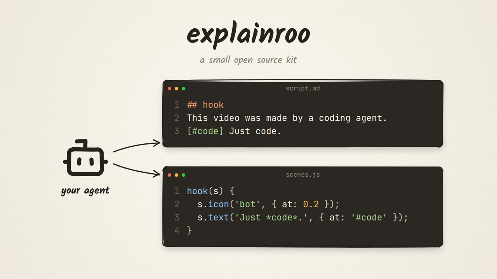
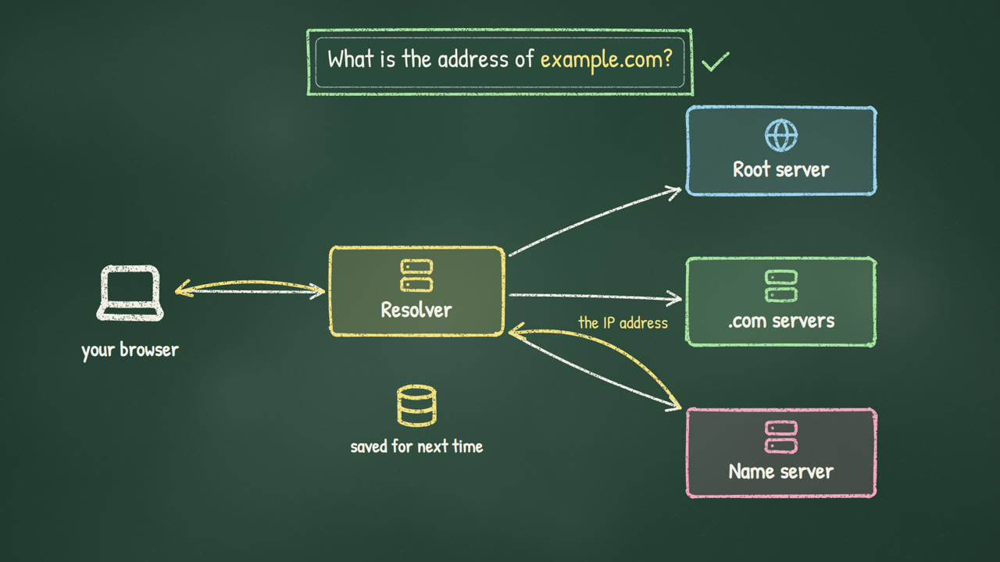
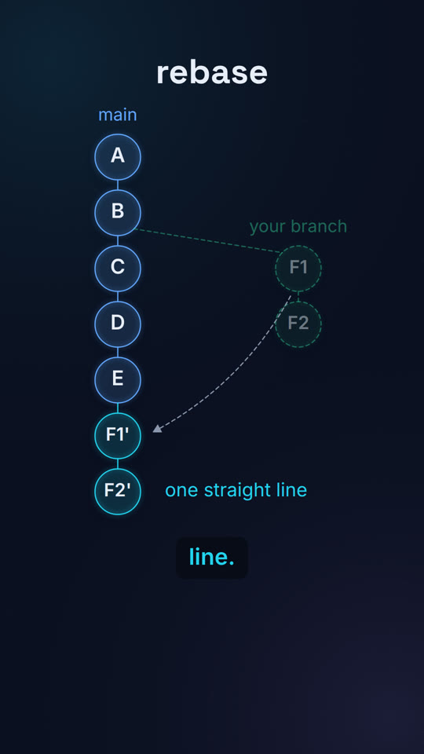
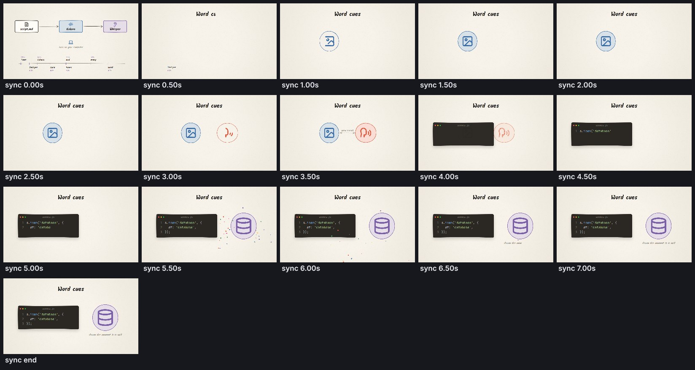

# explainroo

Narrated explainer videos made by your coding agent. Pure JavaScript, a local
voice, no API keys and no video model.

[](https://github.com/vincentsch/explainroo/releases/download/v0.1.0/explainroo-intro.mp4)

*The launch video above was made by a coding agent with explainroo, with sound
([watch the MP4](https://github.com/vincentsch/explainroo/releases/download/v0.1.0/explainroo-intro.mp4)).
Its source is in [examples/explainroo-intro](examples/explainroo-intro).*

Point Claude Code, Codex or any coding agent at this repository and ask for a
video:

> Make a 60 second explainer video about how HTTPS keeps a password secret.

The agent writes two files: a script of what to say and a few lines of
JavaScript for what to show. explainroo does the rest:

- **Speaks the narration** with [Kokoro](https://huggingface.co/hexgrad/Kokoro-82M), a voice model that runs on your own computer.
- **Times every word** by listening back with Whisper, so a picture can appear exactly when it is mentioned: `at: 'database'`.
- **Draws the frames** in headless Chrome in one of five looks, from hand-drawn paper to a dark developer style.
- **Scores it** with music and sound effects that are generated to fit and duck under the voice.
- **Gives your agent eyes**: still frames, contact sheets, a layout check and a speech check, because an agent cannot watch a video.
- **Renders an MP4** with ffmpeg, normalized to -14 LUFS.

Nothing leaves your machine and nothing costs money per video. The speech
models download once (about 400 MB).

## Examples

| | | |
|---|---|---|
| [](https://github.com/vincentsch/explainroo/releases/download/v0.1.0/explainroo-intro.mp4) | [](https://github.com/vincentsch/explainroo/releases/download/v0.1.0/how-dns-works.mp4) | [](https://github.com/vincentsch/explainroo/releases/download/v0.1.0/merge-vs-rebase.mp4) |
| **explainroo in 71 seconds** (paper, 16:9) · [source](examples/explainroo-intro) | **How DNS finds a website** (chalk, 16:9) · [source](examples/how-dns-works) | **git merge vs rebase** (midnight, 9:16 with captions) · [source](examples/merge-vs-rebase) |

## Quick start

You need Node.js 20 or newer, ffmpeg, and Google Chrome or Chromium.

```bash
git clone https://github.com/vincentsch/explainroo.git
cd explainroo
npm install
node bin/explainroo.js doctor --fetch    # checks your setup and downloads the speech models
```

Then open your coding agent in the `explainroo` folder and ask for a video.
The agent follows [AGENTS.md](AGENTS.md), and your finished file lands in
`videos/<name>/out/video.mp4`.

To make one by hand:

```bash
node bin/explainroo.js init videos/hello --theme paper
node bin/explainroo.js preview videos/hello      # live preview in your browser
node bin/explainroo.js render videos/hello       # writes videos/hello/out/video.mp4
```

`npm link` puts `explainroo` on your PATH if you prefer the short command.

## What the agent writes

`script.md` holds the narration, one scene per `##` heading:

```markdown
## sync
So a picture can appear exactly when it is mentioned. [#code] Write one line,
[#say] say the word database, and there it is.
```

`[#code]` marks a moment to animate on. `{SQL|sequel}` shows "SQL" on screen
but says "sequel", and `[pause 0.5]` adds silence.

`scenes.js` draws each scene. Every element gets a time: seconds, a spoken
word, or a marker:

```js
sync(s) {
  s.text('Word cues', { font: 'display', size: 84, y: 160, at: 0.1 });
  s.code("s.icon('database', {\n  at: 'database',\n});", { x: 640, y: 560, at: '#code' });
  s.icon('database', { x: 1450, y: 560, size: 260, color: 'purple', at: 'database' });
  s.burst({ x: 1450, y: 560, at: 'database' });
},
```

The scene API covers titles and text (typed, written on, or revealed word by
word as it is spoken), boxes, arrows that connect elements, 1,850+
[Lucide](https://lucide.dev) icons, lists, counters, bar, line and pie
charts, code and terminal windows, images in browser and phone frames,
underlines and circles for emphasis, a camera, and a raw canvas when you need
it. See [docs/api.md](docs/api.md).

## Five looks

One script, five styles: set `"theme"` in `video.json`.


Each look brings its own fonts, colors, entrances, transition, sound effects
and music style. 16:9, 9:16, 1:1 and 4:5 are supported, and vertical videos
get burned-in captions that follow the voice word by word.

## How the agent checks its work

An agent cannot watch a video, so explainroo turns the video into things it
can read.

```bash
explainroo still videos/hello           # a PNG of every scene when it is fully built
explainroo sheet videos/hello --scene intro   # one scene over time
explainroo check videos/hello           # layout, timing and pronunciation problems
explainroo verify videos/hello          # the finished MP4: loudness, black frames, narration
```



`check` renders every scene at several moments and reports text that runs off
the frame, overlaps other text, is too small or low in contrast, elements
timed after their scene ends, and long stretches where nothing changes. It
also compares what the voice said with what the script asked for. On the
first draft of the DNS example it caught Kokoro reading a domain the wrong way:

```
WARN  question: the voice check could not confirm "example.com?". It heard: "So
before anything loads, your browser has to ask, what is the address of example
calm?". If a word is mispronounced, write it as {shown|spoken} in script.md.
```

Writing `{example.com|example dot com}` in the script fixed it.

`verify` transcribes the final mix to confirm the narration is still
understandable over the music. All three examples score 99 to 100%.

## Commands

| Command | Does |
|---|---|
| `init <dir>` | creates a project (`--theme`, `--size`, `--voice`, `--title`) |
| `voice [project]` | generates narration and word timings, cached per scene |
| `preview [project]` | live preview in your browser that reloads on save |
| `still [project] [times…]` | PNG stills at `12.5`, `scene`, `scene@2.4` |
| `sheet [project]` | contact sheet of the video or one scene |
| `check [project]` | layout, timing and pronunciation problems |
| `render [project]` | the MP4 (`--draft` for a fast half-size version, `--from`, `--to`) |
| `verify [project]` | loudness, black frames, silence and narration in the rendered file |
| `voices`, `say "text"` | list the 28 voices, or hear one |
| `themes`, `icons <word>` | list the looks, search the icons |
| `doctor` | checks Node, ffmpeg, Chrome and the speech models |

Every command accepts `--json`.

## Speed and limits

On a laptop with an 8-core Intel i9-11950H, everything on the CPU, the
67-second DNS example renders at 1080p in about 50 seconds once its voice is
generated. Generating the voice takes a little less time than the narration
lasts, and only changed scenes are generated again.

- Narration is English only (Kokoro's English voices, Whisper base.en).
- Music is synthesized, not sampled. It is meant to sit under a voice, not to
  carry a video on its own.
- The first run downloads about 400 MB of speech models from Hugging Face.
  Set `EXPLAINROO_TTS_DTYPE=q8` for a smaller, slower voice model.
- explainroo draws with code. It does not generate photos or video footage,
  though you can place your own images and screenshots.

## Use it as a skill

[skills/explainroo/SKILL.md](skills/explainroo/SKILL.md) lets an agent make
videos from any folder. For Claude Code, copy `skills/explainroo` into
`~/.claude/skills/`.

## Credits

explainroo stands on open work:
[Kokoro-82M](https://huggingface.co/hexgrad/Kokoro-82M) (Apache-2.0) through
[kokoro-js](https://github.com/hexgrad/kokoro) (Apache-2.0),
[Whisper](https://github.com/openai/whisper) (MIT) through
[Transformers.js](https://github.com/huggingface/transformers.js) (Apache-2.0),
[Rough.js](https://roughjs.com) (MIT), [Lucide](https://lucide.dev) icons
(ISC), [Playwright](https://playwright.dev) (Apache-2.0), fonts under the SIL
Open Font License (see [fonts/licenses](fonts/licenses)), and
[ffmpeg](https://ffmpeg.org), which you install yourself.

## License

MIT
